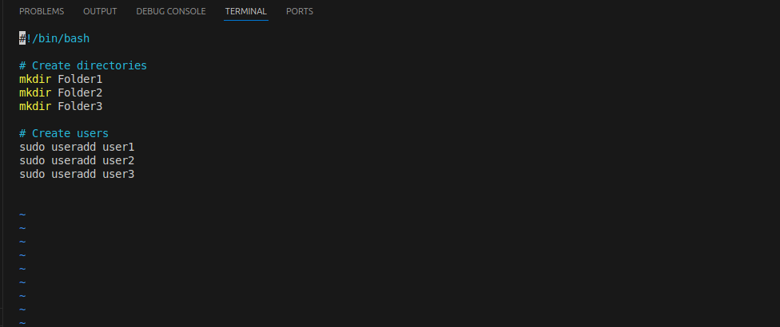
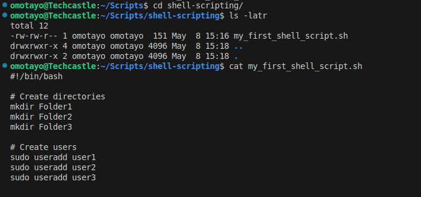
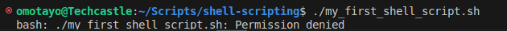
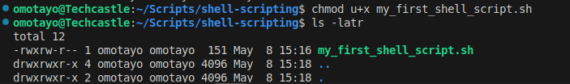

# Linux_shell_scripting

## 1. Creating the shell-scripting folder and adding the my_first_shell_script.sh using Vim

## 2. Getting Permision denied error running the script 

## 3. Adding the executable permission to the owner

## 4. Running the my_first_shell_script.sh without error and confirm folders creation 

## 5. Confirming users creation 

